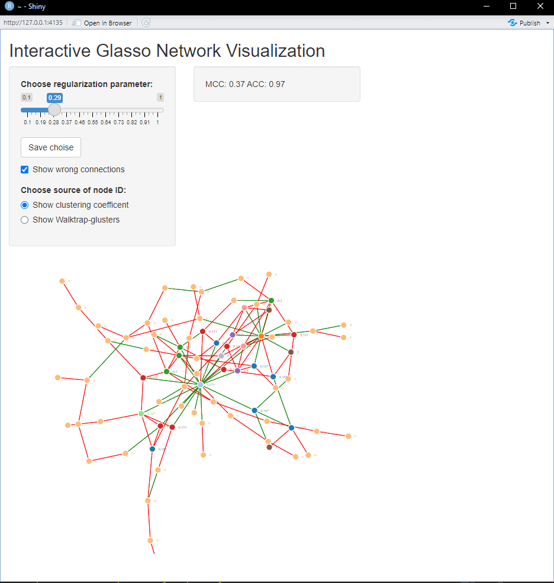

# GIViT

Interactive GLASSO visualization tool. GIViT allows user to load data and visualize the graphical-LASSO result.

# How to use

``` r
 library(devtools)
 install_github("apatrone2/GIViT")
 library(GIViT)
 data <- huge::huge.generator(n = 75, d = 100, graph = "scale-free")
 app <- glasso_manual(data = data$data)
 # or alternatively
 # app <- glasso_manual(data = data$data,real_network = data$theta)
 shiny::runApp(app)
```

GIViT creates an Shiny-application, were user can manually choose and visualize the resulting gLASSO-network


With and without the real network information



# Dependencies

GIViT requires the following libraries: shiny, networkD3, tibble, huge, dplyr, igraph, qgraph. loading and installing required.

``` r
library(shiny)
library(networkD3)
library(tibble)
library(huge)
library(dplyr)
library(igraph)
library(qgraph)
```
