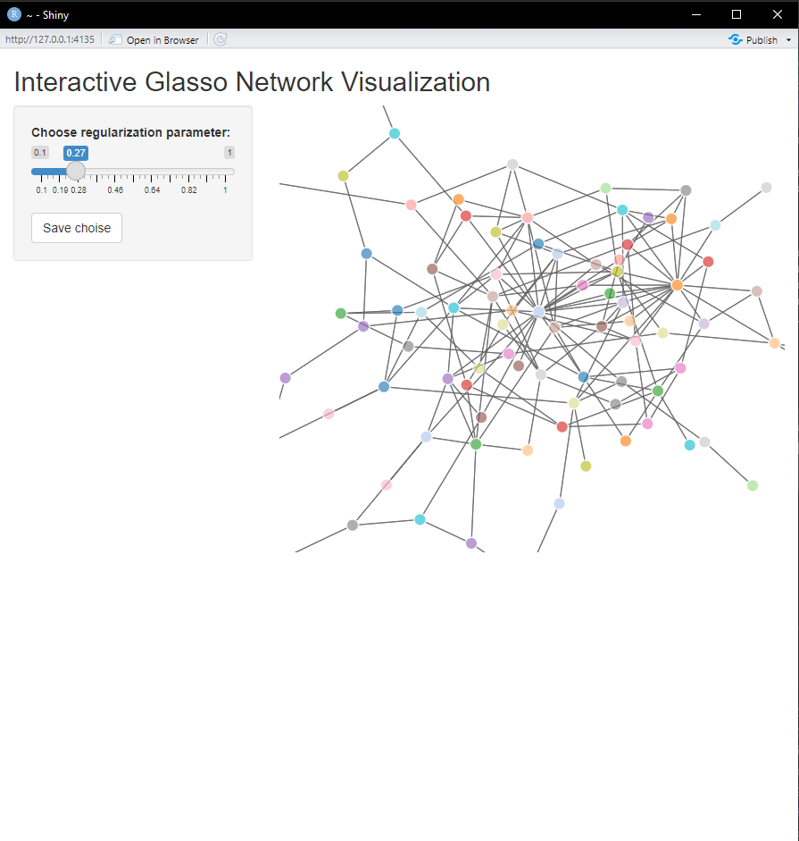

# gViz

Interactive GLASSO visualization tool. gViz allows user to load data and visualize the graphical-LASSO result.

# How to use

``` r
 library(devtools)
 install_github("apatrone2/gViz")
 library(gViz)
 data <- huge::huge.generator(n = 75, d = 100, graph = "scale-free")
 app <- glasso_manual(data = data$data)
 # or alternatively
 # app <- glasso_manual(data = data$data,real_network = data$theta)
 shiny::runApp(app)
```

gViz creates an Shiny-application, were user can manually choose and visualize the resulting gLASSO-network



With and without the real network information


